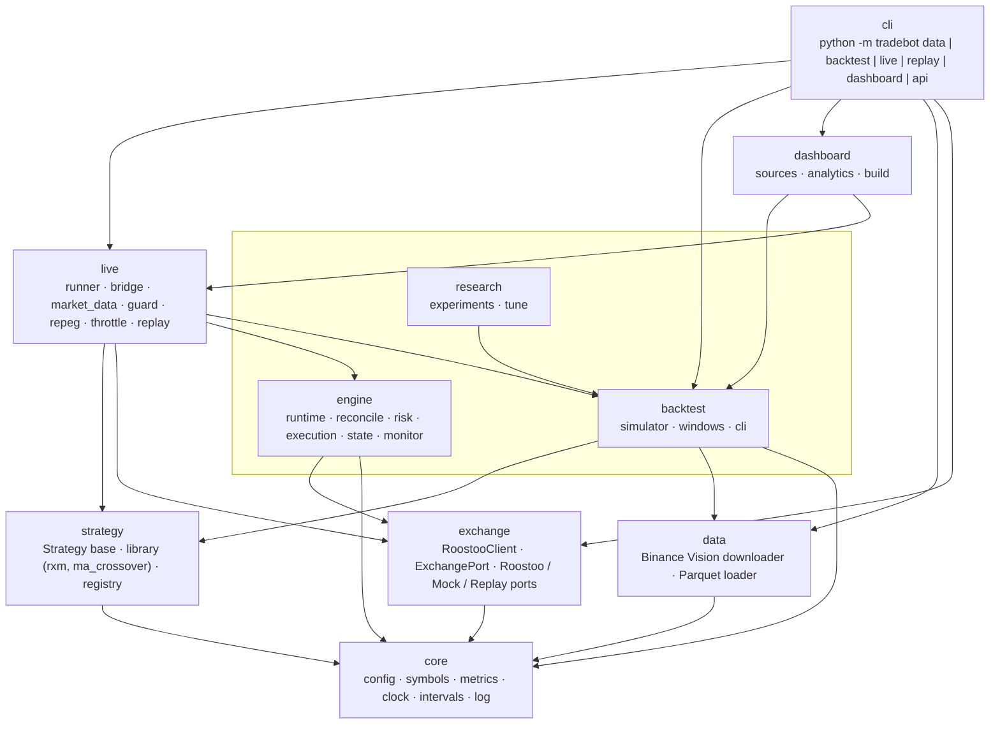
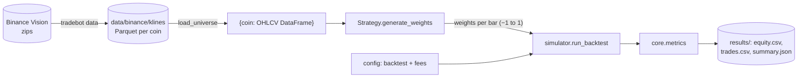
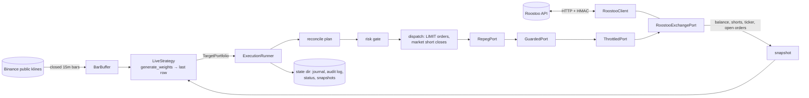

# Architecture

The bot is one installable Python package, `tradebot` (`src/tradebot/`), with one exchange client and one CLI. Configuration is one model, with a defaults file and a competition override file. The backtester and the live bot run the **same strategy code** on the same candles, with the same symbols, fee schedule, order policy and metrics. Results from one should therefore predict the other.

## Layers

Dependencies only point downward. Lower layers never import higher ones.



| Package | Responsibility | Key modules |
|---|---|---|
| `core` | Shared foundations, with no I/O except reading config | `config.py`: `Settings` with `fees`, `exchange`, `execution`, `backtest`, `data` and `live` sections. `symbols.py`: coin ↔ `BTC/USD` ↔ `BTCUSDT`. `metrics.py`: return, Sharpe, Sortino, Calmar, drawdown. `clock.py`: `Clock`, `RealClock`, `SimClock`. `intervals.py`. `log.py`. |
| `exchange` | Everything that talks to Roostoo | `client.py`: `RoostooClient` (signing, timeouts, retries, caching, throttling, request logging). `port.py`: `ExchangePort` Protocol and `RoostooExchangePort`. `mock.py`: `MockExchangePort` (instant fills). `replay.py`: `ReplayExchangePort` (replays candles; limits fill when price trades through). `manual.py`: interactive API menu. |
| `data` | Historical market data | `binance_vision.py`: download and verify Binance Vision klines into Parquet. `loader.py`: `load_klines`, `load_universe` (keyed by coin). |
| `strategy` | Trading logic as target weights | `base.py`: `Strategy.generate_weights(data) -> DataFrame`. `library/rxm.py`: RXM, the competition strategy (frozen `PRESETS`, `UNIVERSE`). `library/ma_crossover.py`. `registry.py`: name → class. |
| `backtest` | Offline evaluation | `simulator.py`: `run_backtest` (limit fills, short fees, liquidation, lock-in, latency stress), `buy_and_hold`. `windows.py`: rolling competition windows. `cli.py`. |
| `research` | RXM research | `experiments.py`: presets on 14-day windows, discovery and hold-out. `tune.py`: grid search with train/validate discipline. |
| `engine` | Live order execution | `runtime.py`: one cycle of the strategy loop. `reconcile/`: plan and stale-order cancellation. `risk/`: risk gate. `execution/runner.py`: order policy, idempotency, dispatch. `state/`: snapshot, intent journal, audit log. `monitor/`: stop-loss and take-profit. `schema/`: `TargetPortfolio`. `app.py`: `Engine` facade. |
| `live` | Running a backtested strategy live | `market_data.py`: `BarBuffer` of closed 15m candles (Binance REST or Parquet). `bridge.py`: `LiveStrategy` (any `Strategy` → `TargetPortfolio`) and `CompetitionStrategy` (RXM presets, lock-in). `guard.py`: pre-trade and per-loop checks, kill switch. `repeg.py`, `throttle.py`: order transport. `runner.py`: `LiveRunner`, the unattended loop. `replay.py`: the runner on replayed candles. |
| `dashboard` | Monitoring | `build.py`: one self-contained HTML page from a backtest or a live/replay state directory. |
| `cli` | Entry point | `cli.py` and `__main__.py` |

## Backtest flow



## Live flow



The live bridge runs exactly the backtest code. `LiveStrategy` keeps `BarBuffer` up to date, calls `Strategy.generate_weights(buffer.data())` once per rebalance period, and converts the last row into a `TargetPortfolio`:
- a positive weight becomes a `LongTarget` with a passive limit price;
- a negative weight becomes a `ShortTarget` with `collateral = |w| × equity`;
- symbols within the 1% band stay frozen at their current size;
- the `signal_id` is stable per decision, with a re-quote id when an unfilled limit must be re-placed at a new bar.

Tests assert that live weights equal the backtest's on real data. `LiveRunner` supervises the loop: exponential backoff on failures, kill switch, guard, heartbeat and `status.json`. `replay` runs the same runner against `ReplayExchangePort` on a simulated clock.

## Conventions

- **Symbols:** inside the package a symbol is always the bare coin (`"BTC"`). Convert only at the edges: Roostoo pairs with `to_pair`, Binance with `to_binance` (data layer only).
- **One config model:** every tunable lives in `config/default.yaml` (competition overrides in `config/competition.yaml`), validated by pydantic models that reject unknown keys. Load it with `Settings.load()` (or `$TRADEBOT_CONFIG` / `--config`). CLI flags only override values; they never set their own defaults. Secrets come only from `.env`.
- **One fee schedule:** `fees` (spot maker/taker, short open/close) is shared by the simulator, the engine's risk checks and the mock exchange.
- **Order policy is the same in both modes:**
  - Limit orders at the last close, alive for one bar.
  - Short opens are limit orders but pay the 0.1% short-open fee.
  - Short closes are market orders.
- **Time:** engine code never calls `time` or `datetime.now` directly; it uses an injected `Clock`. A test enforces this, so simulated and live runs share the same logic.
- **Errors and logging:** library code uses `logging.getLogger(__name__)`; only CLIs `print`. The client raises `RoostooError` rather than returning `None`. Order requests are never retried automatically.
- **Units:** returns and drawdowns are decimal fractions (0.05 = 5%); drawdowns are ≤ 0. Money is USD.
- **Typed contracts:** pydantic for external inputs (`TargetPortfolio`, config), dataclasses for internal records.

## Repository layout

```
config/                default.yaml (every setting, defaults) and competition.yaml (RXM overrides)
src/tradebot/           the package (layers above)
tests/                  pytest suite (engine, client, simulator, RXM incl. golden weights, bridge, guard, runner, wire)
docs/                   STRATEGY_SPEC, LIVE_RUNBOOK, ARCHITECTURE (this), REVIEW, VALIDATION, TUNING, DASHBOARD, ...
data/  results/  var/   generated: market data, backtest outputs, engine state (git-ignored)
.env                    API keys (git-ignored; template in .env.example)
```
