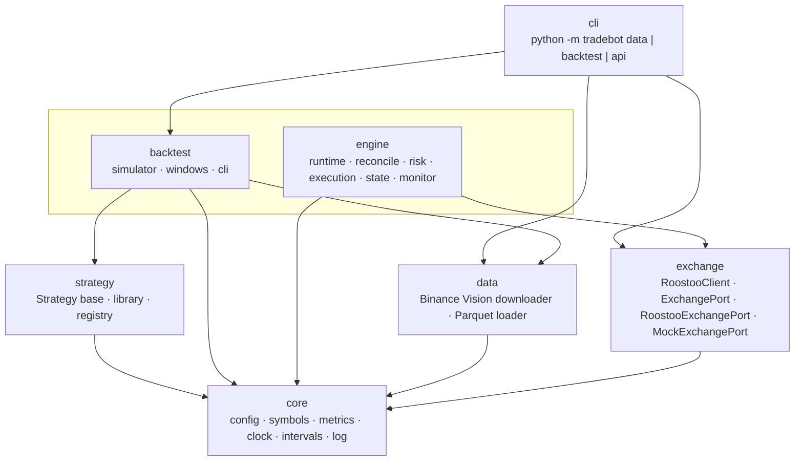
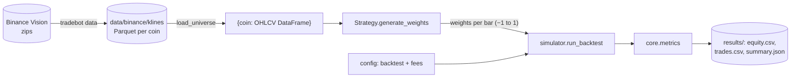
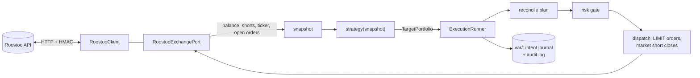

# Architecture

The bot is one installable Python package, `tradebot` (`src/tradebot/`), with one config file, one exchange client and one CLI. The backtester and the live engine share the same strategy interface, symbols, fee schedule and metrics. Results from one should therefore predict the other.

## Layers

Dependencies only point downward. Lower layers never import higher ones.



| Package | Responsibility | Key modules |
|---|---|---|
| `core` | Shared foundations, with no I/O except reading config | `config.py`: `Settings` with `fees`, `exchange`, `execution`, `backtest` and `data` sections. `symbols.py`: coin ↔ `BTC/USD` ↔ `BTCUSDT`. `metrics.py`: return, Sharpe, Sortino, Calmar, drawdown. `clock.py`: `Clock`, `RealClock`, `SimClock`. `intervals.py`. `log.py`. |
| `exchange` | Everything that talks to Roostoo | `client.py`: `RoostooClient` (signing, timeouts, retries, caching, throttling, request logging). `port.py`: `ExchangePort` Protocol and `RoostooExchangePort`. `mock.py`: `MockExchangePort`. `manual.py`: interactive API menu. |
| `data` | Historical market data | `binance_vision.py`: download and verify Binance Vision klines into Parquet. `loader.py`: `load_klines`, `load_universe` (keyed by coin). |
| `strategy` | Trading logic as target weights | `base.py`: `Strategy.generate_weights(data) -> DataFrame`. `library/`: concrete strategies. `registry.py`: name → class. |
| `backtest` | Offline evaluation | `simulator.py`: `run_backtest`, `buy_and_hold`. `windows.py`: rolling 7-day competition windows. `cli.py`. |
| `engine` | Live order execution | `runtime.py`: one cycle of the strategy loop. `reconcile/`: plan and stale-order cancellation. `risk/`: risk gate. `execution/runner.py`: order policy, idempotency, dispatch. `state/`: snapshot, intent journal, audit log. `monitor/`: stop-loss and take-profit. `schema/`: `TargetPortfolio`. `app.py`: `Engine` facade. |
| `cli` | Entry point | `cli.py` and `__main__.py` |

## Backtest flow



## Live flow



There is no live strategy adapter or market-data feed yet; see `docs/REVIEW.md`. The intended bridge is a callable that takes the snapshot, keeps a buffer of recent candles, calls `Strategy.generate_weights` on each completed bar, and converts the last row into a `TargetPortfolio`:
- a positive weight becomes a `LongTarget`;
- a negative weight becomes a `ShortTarget` with `collateral = |w| × equity`;
- the `signal_id` is set once per bar.

## Conventions

- **Symbols:** inside the package a symbol is always the bare coin (`"BTC"`). Convert only at the edges: Roostoo pairs with `to_pair`, Binance with `to_binance` (data layer only).
- **One config:** every tunable lives in `config/default.yaml`, validated by pydantic models that reject unknown keys. Load it with `Settings.load()` (or `$TRADEBOT_CONFIG` / `--config`). CLI flags only override values; they never set their own defaults. Secrets come only from `.env`.
- **One fee schedule:** `fees` (spot maker/taker, short open/close) is shared by the simulator, the engine's risk checks and the mock exchange.
- **Order policy is the same in both modes:**
  - Limit orders at the last close, alive for one bar.
  - Short opens are limit orders but pay the 0.1% short-open fee.
  - Short closes are market orders.
- **Time:** engine code never calls `time` or `datetime.now` directly; it uses an injected `Clock`. A test enforces this, so simulated and live runs share the same logic.
- **Errors and logging:** library code uses `logging.getLogger(__name__)`; only CLIs `print`. The client raises `RoostooError` rather than returning `None`. Order requests are never retried automatically.
- **Units:** returns and drawdowns are decimal fractions (0.05 = 5%); drawdowns are ≤ 0. Money is USD.
- **Typed contracts:** pydantic for external inputs (`TargetPortfolio`, config), dataclasses for internal records.

## Repository layout

```
config/default.yaml     the only config file
src/tradebot/           the package (layers above)
tests/                  pytest suite (engine, client with a fake HTTP session, backtest simulator, core)
docs/                   ARCHITECTURE (this), REVIEW, ENGINE, BACKTESTING, ROOSTOO_API, DESIGN
data/  results/  var/   generated: market data, backtest outputs, engine state (git-ignored)
.env                    API keys (git-ignored; template in .env.example)
```
